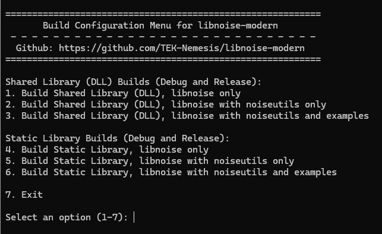

# libnoise-modern (Version 1.1.0)

Welcome to **libnoise-modern**, a modernized fork of the classic `libnoise` library, updated to leverage C++17 features and improve cross-platform compatibility. This repository maintains the core functionality of `libnoise` for generating coherent noise, while introducing significant enhancements for performance, usability, and maintainability. The library is ideal for procedural content generation in games, simulations, and visualizations, supporting applications like terrain generation, texture creation, and more.

The original `libnoise` documentation is available at libnoise.sourceforge.net and provides detailed insights into the library's noise modules and usage patterns.

## Overview

`libnoise-modern` builds upon the foundational work of the `libnoise` library, originally developed by **Jason Bevins**. This fork, led by **TEK Nemesis**, modernizes the codebase to align with contemporary C++ standards, enhances build processes, and ensures compatibility with both Windows and Linux platforms. The library retains its core capability to generate Perlin, Voronoi, and other noise types, while introducing optimizations and new features.

### Key Features

- **C++17 Compliance**: The codebase has been fully updated to use C++17 features for improved safety, performance, and readability.
- **Cross-Platform Support**: Build scripts and CMake configurations support Windows and Linux, with simplified execution from the main folder.
- **Multithreading**: Noise generation is thread-safe, allowing parallel processing for performance-critical applications (e.g., terrain generation).
- **Example Executables**: Pre-built examples (e.g., `worms`, `texturejade`, `complexplanet`) are automatically generated in the `bin` folder, showcasing practical applications.
- **Modern Build System**: Separate `CMakeLists.txt` for `libnoise` core and comprehensive build scripts for ease of use.
- **Documentation Reference**: Retains compatibility with the original `libnoise` documentation for module usage and concepts.

## Modernization to C++17

The `libnoise-modern` repository has undergone extensive updates to ensure C++17 compliance and improve code quality. Key changes include:

- **Memory Management**: Replaced raw pointer arrays (`m_pSourceModule`) with `std::vector` for safer and more flexible source module management.
- **Inline Methods**: Moved critical methods like `GetValue` and `GetSourceModuleCount` to headers as inline functions to optimize performance.
- **Modern Syntax**:
  - Used `constexpr` for constants (e.g., `DEFAULT_FREQUENCY`) to ensure compile-time evaluation.
  - Replaced `NULL` with `nullptr` for type safety.
  - Adopted `noexcept` specifiers for functions that do not throw exceptions.
  - Added `override` to virtual functions for clarity and safety.
  - Used `[[nodiscard]]` for getter methods to encourage proper use of return values.
- **Standard Library Usage**: Replaced custom utilities with standard C++ equivalents (e.g., `std::sqrt`, `std::floor`, `std::min`, `std::max`, `std::clamp`).
- **Memory Safety**: Eliminated manual memory management in modules like `Terrace` by using `std::vector` for control points.
- **Error Handling**: Improved assertions and exception handling for robustness (e.g., checking source module pointers).
- **Macro Conflict Resolution**: Added `#undef min` and `#undef max` to avoid Windows macro conflicts with `std::min` and `std::max`.
- **Documentation**: Updated Doxygen comments for consistency and removed redundant group tags.

These changes enhance the library’s reliability, maintainability, and performance while preserving its core functionality.

## Multithreading

`libnoise-modern` is designed to be thread-safe, allowing multiple threads to generate noise simultaneously without data races. This is particularly useful for applications requiring large-scale procedural content generation, such as terrain or texture maps. Key considerations:

- Noise modules are stateless or use immutable data, ensuring safe concurrent access.
- Users can parallelize noise generation across multiple threads (e.g., dividing a terrain grid into chunks).
- Example applications demonstrate thread-safe usage, and the library’s design supports integration with multithreaded game engines or simulations.

## Build System

The repository includes a robust build system based on CMake, with separate configurations for the core library and utilities:

- **Core Library (**`noise` **folder)**: The `noise` folder contains its own `CMakeLists.txt` for building the `libnoise` library independently. Refer to `noise/README.md` for detailed instructions on building `libnoise`, including dependencies and configuration options.
- **Full Project**: The main folder’s `CMakeLists.txt` supports building `libnoise`, `noiseutils`, and example applications together.

### Build Scripts

To simplify the build process, cross-platform scripts are provided which will display a menu of output options (e.g. creation of DLL), in the main folder:

- **Windows**: `build_windows.bat`
  - Cleans old build artifacts.
  - Creates a `build` directory.
  - Generates a Visual Studio solution using CMake.
  - Builds Debug and Release configurations for the selected target (e.g., `libnoise`, `noiseutils`, examples).
- **Linux**: `build_linux.sh`
  - Performs similar steps to the Windows script, tailored for Linux environments.
  - Uses CMake to generate makefiles and builds the project with `make`.
  - Supports Debug and Release configurations.

**Usage**:

1. Navigate to the main folder (`libnoise-modern`).
2. Run the appropriate script:
   - Windows: `build_windows.bat`
   - Linux: `./build_linux.sh`
3. Select the desired build option (e.g., option 3 for Shared Library with `libnoise`, `noiseutils`, and examples).
4. The script handles configuration and compilation automatically.

### Example Executables

After running the build script, example executables (`.exe` on Windows, ELF binaries on Linux) are automatically generated in the `bin` folder. Examples include:

- `worms`: Demonstrates an unusual application of libnoise to render and animate worm-like creatures in real time.
- `texturejade`, `texturegranite`, `texturewood`, `texturesky`, `textureslime`: Create procedural textures generated by libnoise.
- `complexplanet`: Demonstrates a complex planetary terrain.

These examples showcase the library’s capabilities and serve as starting points for custom applications.

## Documentation

For detailed information on noise modules, their usage, and mathematical foundations, refer to the original `libnoise` documentation at libnoise.sourceforge.net. The `libnoise-modern` library maintains compatibility with these modules, so the documentation remains relevant. Additional details specific to modernization changes and build instructions are available in `noise/README.md`.

## Credits

`libnoise-modern` builds on the foundational work of the original `libnoise` library, created by **Jason Bevins**, whose innovative design made procedural noise generation accessible to developers. Significant contributions to the original library were also made by **Keith Davies**, whose efforts helped refine and expand its capabilities. The modernization effort, led by **TEK Nemesis**, brings the library into the C++17 era, with contributions from the open-source community.

Special thanks to all contributors whose names appear in the source files, including those who provided bug fixes, optimizations, and documentation. Your hard work has made `libnoise` and `libnoise-modern` enduring tools for procedural content generation.

## Contributing

Contributions are welcome! To contribute:

1. Fork the repository at github.com/TEK-Nemesis/libnoise-modern.
2. Create a branch for your feature or bug fix.
3. Submit a pull request with a clear description of your changes.

Please ensure your code adheres to C++17 standards and includes appropriate tests or examples.

## License

`libnoise-modern` is licensed under the GNU Lesser General Public License (LGPL) version 2.1 or later, consistent with the original `libnoise` library. 

## Version

This is **version 1.1.0** of `libnoise-modern`. Once testing is complete, a release will be created on GitHub at github.com/TEK-Nemesis/libnoise-modern.

## Contact

For issues, feature requests, or questions, please open an issue on the GitHub repository or contact **TEK Nemesis** via GitHub.

---

Happy noise generation!
