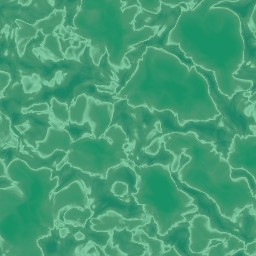
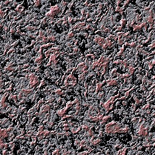
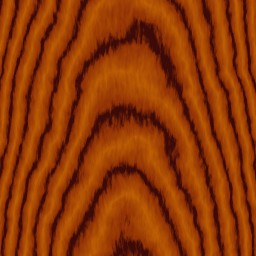
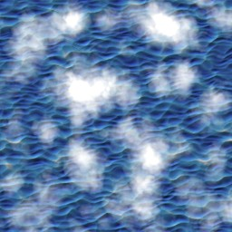
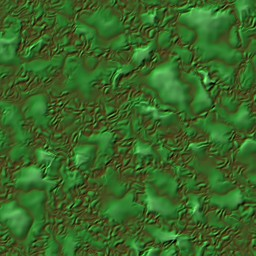
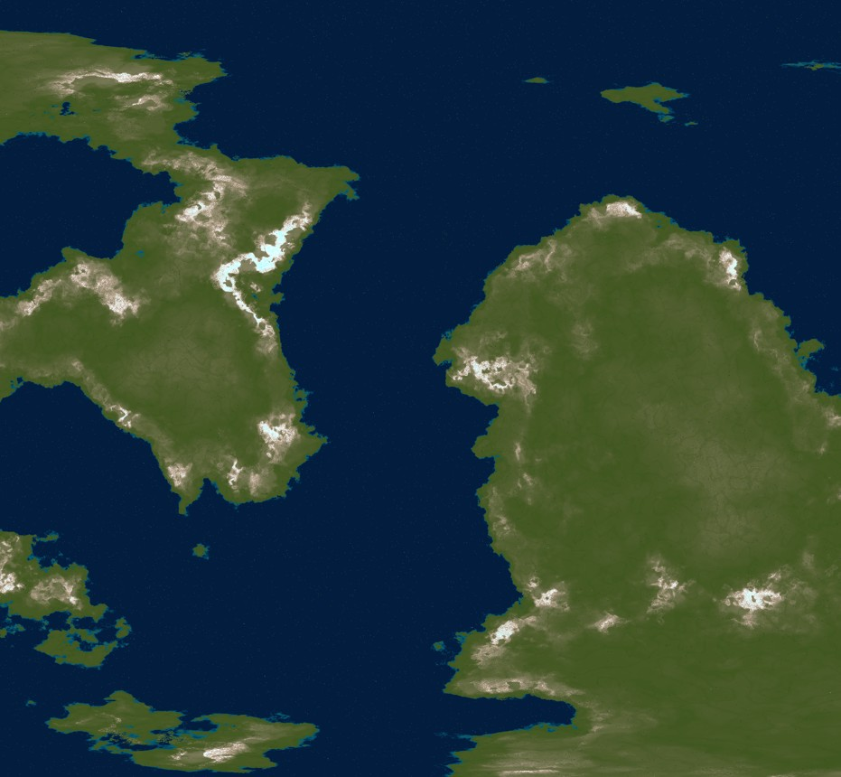
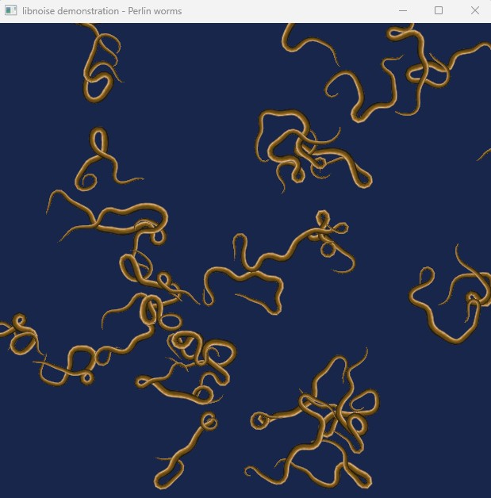

# Examples

## Overview

The `examples` folder contains sample applications demonstrating the capabilities of the `libnoise` library for procedural content generation. These examples showcase practical applications such as generating procedural textures (`texturejade`, `texturegranite`, `texturewood`, `texturesky`, `textureslime`), complex planetary terrains (`complexplanet`), and animated procedural creatures (`worms`). They are modernized versions of the originals created by **Jason Bevins** in 2005, updated by **TEK Nemesis** for C++17 compliance and cross-platform compatibility as part of `libnoise-modern`.

The source code for these examples is released under the terms of the [GNU General Public License](https://www.gnu.org/licenses/gpl-2.0.html).

## Building and Running

To build the examples, use the build scripts in the main `libnoise-modern` folder (`../`):

- **Windows**: Run `build_windows.bat` and select option 3 (Shared Library with `libnoise`, `noiseutils`, and examples).
- **Linux**: Run `./build_linux.sh` and select option 3.

The compiled executables (e.g., `worms.exe` on Windows, `worms` on Linux) will be placed in the `bin` folder. Run them directly to see the generated outputs, which may include noise maps, images (e.g., BMP files), or real-time animations.

### Dependencies
- **All examples** require the `libnoise` library (`noise`).
- **`worms.cpp`** requires the OpenGL Extension Wrangler Library ([GLEW](https://github.com/Perlmint/glew-cmake)) for OpenGL functionality.
- **`complexplanet.cpp`**, **`texturejade.cpp`**, **`texturegranite.cpp`**, **`texturewood.cpp`**, **`texturesky.cpp`**, and **`textureslime.cpp`** require the `noiseutils` library for noise map rendering.

## SourceForge Reference

For detailed explanations of each example, including their noise module configurations and output descriptions, refer to the original documentation at [libnoise.sourceforge.net/examples/](https://libnoise.sourceforge.net/examples/). Note that the SourceForge examples reflect the 2005 versions, while these have been updated for modern C++ standards and compatibility.

## Examples Included

### Procedural Textures

These examples generate procedural textures using `libnoise` and render them as noise maps with the help of the `noiseutils` library. The output images showcase various noise patterns suitable for texturing in games, simulations, and visualizations.

<table>
  <tr>
    <td align="center">
      
       <a href="https://libnoise.sourceforge.net/examples/textures/index.html">texturejade.cpp</a>
    </td>
    <td align="center">
      
       <a href="https://libnoise.sourceforge.net/examples/textures/index.html">texturegranite.cpp</a>
    </td>
    <td align="center">
      
       <a href="https://libnoise.sourceforge.net/examples/textures/index.html">texturewood.cpp</a>
    </td>
  </tr>
  <tr>
    <td align="center">
      
       <a href="https://libnoise.sourceforge.net/examples/textures/index.html">texturesky.cpp</a>
    </td>
    <td align="center">
      
       <a href="https://libnoise.sourceforge.net/examples/textures/index.html">textureslime.cpp</a>
    </td>
    <td></td>
  </tr>
</table>

### Complex Planetary Surface

This example generates a complex planetary surface using multiple noise layers, rendered as a noise map with the `noiseutils` library. The output showcases a detailed terrain suitable for simulating planetary landscapes.

<table>
  <tr>
    <td align="center">
      
       <a href="https://libnoise.sourceforge.net/examples/complexplanet/index.html">complexplanet.cpp</a>
    </td>
  </tr>
</table>

### Perlin Worms

This example demonstrates an unusual application of `libnoise` to render and animate worm-like creatures in real-time using OpenGL (via `GLEW`). The worms move and twist procedurally, showcasing dynamic noise-based animation.

<table>
  <tr>
    <td align="center">
      
       <a href="https://libnoise.sourceforge.net/examples/worms/index.html">worms.cpp</a>
    </td>
  </tr>
</table>

#### Keyboard Controls for worms.cpp
While running `worms.cpp`, you can interact with the animation using the following keyboard controls:

| Key | Action                                    |
|-----|-------------------------------------------|
| Esc | Exits the program                         |
| Q   | Increase the number of worms by one (maximum 1024) |
| A   | Decrease the number of worms by one       |
| W   | Increase the number of worm segments by one (maximum 256) |
| S   | Decrease the number of worm segments by one |
| E   | Increase the worms' speed                 |
| D   | Decrease the worms' speed                 |
| R   | Increase the lateral (thrashing) speed of the worms |
| F   | Decrease the lateral (thrashing) speed of the worms |
| T   | Increase the worms' thickness             |
| G   | Decrease the worms' thickness             |
| Y   | Increase the worms' "twistiness"          |
| H   | Decrease the worms' "twistiness"          |

## Contributing

To contribute new examples or improvements, submit a pull request to the `libnoise-modern` repository at [github.com/TEK-Nemesis/libnoise-modern](https://github.com/TEK-Nemesis/libnoise-modern). Ensure examples are compatible with C++17 and align with the project’s modernization goals.
